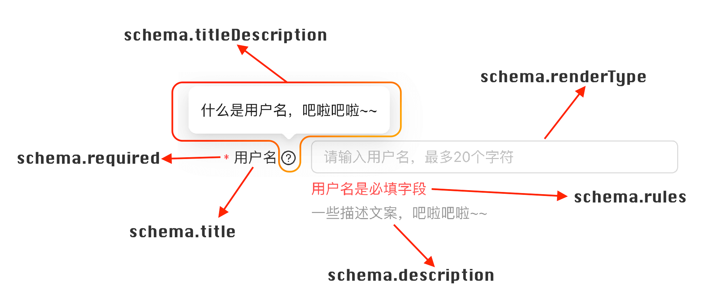

# 协议介绍 Schema

## 协议大图



## 基础协议

基础协议用于描述表单项的基础功能。

### title

定义表单项的标题，如大图所示。

### titleDescription

定义表单项的标题的描述，如大图所示。

### description

定义表单项的描述，如大图所示。

### renderType

定义表单项的渲染主体内容，如大图所示。
`renderType` 可以称为「渲染类型」或「渲染器名称」，其值对应注册在「渲染器列表」的渲染器。

详情请移步至 [渲染器 Renderer](./220-renderer)

### renderOptions

定义传递给渲染器组件的参数，`object` 类型。

以下通过自定义 `placeholder` 和 Select `枚举值` 做个示例。

```tsx {11-14}
/**
 * defaultShowCode: true
 */
import Core from '@schema-render/core-react'
import type { IRootSchema } from '@schema-render/core-react'
import Horizontal from './item-layout/Horizontal'
import renderers from './renderers/common'

const schema: IRootSchema = {
  renderType: 'Root',
  properties: {
    title: {
      title: '标题',
      renderType: 'InputText',
      // 通过 renderOptions 向 InputText 传递自定义的 placeholder 内容
      renderOptions: {
        placeholder: '这是自定义的 placeholder',
      },
    },
    fruit: {
      title: '水果',
      renderType: 'Select',
      // 通过 renderOptions 向 Select 传递枚举值以及自定义 placeholder
      renderOptions: {
        placeholder: '请选择一个甜甜的水果',
        options: [
          { label: '苹果', value: 'apple' },
          { label: '香蕉', value: 'banana' },
          { label: '西瓜', value: 'watermelon' },
        ],
      },
    },
  },
}

const Demo = () => {
  return <Core schema={schema} itemLayout={Horizontal} renderers={renderers} />
}

export default Demo
```

## 结构协议

结构协议可以创建嵌套的 Schema 内容，目前支持 Object 和 Array 结构类型。

### 对象结构 Object

对象结构可以声明嵌套的对象类型 Schema 结构，`renderType` 以 `Object` 开头，同时需要注册对应的对象渲染器。

详情请移步至 [结构渲染器-对象 Object](./221-renderer-object)

### 数组结构 Array

数组结构可以声明嵌套的数组类型 Schema 结构，`renderType` 以 `Array` 开头，同时需要注册对应的数组渲染器。

详情请移步至 [结构渲染器-数组 Array](./222-renderer-array)

## 状态协议

顾名思义，控制表单项状态的协议，通过声明 `Boolean` 值或者`表达式`来控制表单项的状态，如必填、隐藏、禁用、只读。

- `Boolean`: 适用于静态状态控制，直接声明
- `表达式`: 适用于动态状态控制

此类协议的表达式变量包含如下

- `$`: 表示当前层级的对象数据
- `$root`: 表示表单的数据
- `$userCtx`: 表示 `userCtx` 的数据

### required

控制表单项是否`必填`，必填时表单项会增加 `is-required` 类名。

以下是直接声明 `Boolean` 值和`表达式`动态控制两种使用方式的示例。

```tsx
/**
 * defaultShowCode: true
 */
import Core from '@schema-render/core-react'
import type { IRootSchema } from '@schema-render/core-react'
import Horizontal from './item-layout/Horizontal'
import renderers from './renderers/common'

const schema: IRootSchema = {
  renderType: 'Root',
  properties: {
    title: {
      title: '标题',
      renderType: 'InputText',
      // 声明「标题」为必填项，未填时提交将被禁止
      required: true,
    },
    open: {
      renderType: 'Switch',
      title: '开启水果必填',
    },
    fruit: {
      title: '水果',
      renderType: 'Select',
      /**
       * 通过 JavaScript 表达式控制表单项的禁用状态
       * 表达式最后的结果需要是 boolean 值
       *
       * 下面的含义是：如果当前层级下的 open 字段的值为 true，那么必填，否则不必填
       */
      required: '$.open',
      renderOptions: {
        options: [
          { label: '苹果', value: 'apple' },
          { label: '香蕉', value: 'banana' },
          { label: '西瓜', value: 'watermelon' },
        ],
      },
    },
  },
}

const Demo = () => {
  return <Core schema={schema} itemLayout={Horizontal} renderers={renderers} />
}

export default Demo
```

### disabled

控制表单项是否`禁用`，禁用时表单项会增加 `is-disabled` 类名。

```tsx
import Core from '@schema-render/core-react'
import type { IRootSchema } from '@schema-render/core-react'
import Horizontal from './item-layout/Horizontal'
import renderers from './renderers/common'

const schema: IRootSchema = {
  renderType: 'Root',
  properties: {
    title: {
      title: '标题',
      renderType: 'InputText',
      disabled: true,
    },
    open: {
      renderType: 'Switch',
      title: '开启水果禁用',
    },
    fruit: {
      title: '水果',
      renderType: 'Select',
      disabled: '$.open === true',
      renderOptions: {
        options: [
          { label: '苹果', value: 'apple' },
          { label: '香蕉', value: 'banana' },
          { label: '西瓜', value: 'watermelon' },
        ],
      },
    },
  },
}

const Demo = () => {
  return <Core schema={schema} itemLayout={Horizontal} renderers={renderers} />
}

export default Demo
```

### readonly

控制表单项是否`只读`，只读时表单项会增加 `is-readonly` 类名。

常应用于表单详情页的数据展示。

```tsx
import { useState } from 'react'
import Core from '@schema-render/core-react'
import type { IRootSchema } from '@schema-render/core-react'
import Horizontal from './item-layout/Horizontal'
import renderers from './renderers/common'

const schema: IRootSchema = {
  renderType: 'Root',
  properties: {
    title: {
      title: '提问',
      renderType: 'InputText',
      readonly: true,
    },
    fruit: {
      title: '答案',
      renderType: 'Select',
      readonly: '$.open === true',
      renderOptions: {
        options: [
          { label: '苹果', value: 'apple' },
          { label: '香蕉', value: 'banana' },
          { label: '西瓜', value: 'watermelon' },
        ],
      },
    },
    open: {
      renderType: 'Switch',
      title: '切换到只读态',
    },
  },
}

const Demo = () => {
  const [value, setValue] = useState<object>({
    title: '哪一种水果最甜呢',
    fruit: 'watermelon',
  })

  return (
    <Core
      value={value}
      schema={schema}
      onChange={setValue}
      itemLayout={Horizontal}
      renderers={renderers}
    />
  )
}

export default Demo
```

### hidden

控制表单项是否`隐藏`，隐藏的表单项数据仍然存在。

```tsx
import Core from '@schema-render/core-react'
import type { IRootSchema } from '@schema-render/core-react'
import Horizontal from './item-layout/Horizontal'
import renderers from './renderers/common'

const schema: IRootSchema = {
  renderType: 'Root',
  properties: {
    title: {
      title: '标题',
      renderType: 'InputText',
      hidden: true,
    },
    open: {
      renderType: 'Switch',
      title: '隐藏水果选择',
    },
    fruit: {
      title: '水果',
      renderType: 'Select',
      hidden: '$.open === true',
      renderOptions: {
        options: [
          { label: '苹果', value: 'apple' },
          { label: '香蕉', value: 'banana' },
          { label: '西瓜', value: 'watermelon' },
        ],
      },
    },
  },
}

const Demo = () => {
  return <Core schema={schema} itemLayout={Horizontal} renderers={renderers} />
}

export default Demo
```

## 样式控制协议

### className

给表单项设置类名。

```tsx {7} | pure
const schema = {
  renderType: 'Root',
  properties: {
    title: {
      title: '标题',
      renderType: 'InputText',
      className: 'my-title',
    },
  },
}
```

### style

给表单项设置样式，同 `className`。

### span

设置栅格布局模式下，表单项占用的栅格宽度。

详情请移步至 [布局结构 layout](./100-layout)

### spanStart

设置栅格布局模式下，表单项的起始位置。

详情请移步至 [布局结构 layout](./100-layout)

## 数据校验协议

数据校验协议通过 `rules` 关键字定义，`rules` 规则是借鉴 async-validator API 内部实现的一套校验能力子集，以保持 JSON Schema 可序列化，以及核心库的轻量好用。

支持规则如下列表，都是可选项，同时规则可以不声明 `type` 字段，内核会自动推断，声明则具有更高优先级。

<div class="api-table-col-3">

| **名称**      | **说明**                                                                       | **类型**  |
| ------------- | ------------------------------------------------------------------------------ | --------- |
| **type**      | 定义数据的 JavaScript 数据类型，符合定义才能校验通过，不填则自动推断           | `string`  |
| **required**  | 是否必填                                                                       | `boolean` |
| **min**       | string 类型为字符串最小长度；number 类型时为最小值；array 类型时为数组最小长度 | `number`  |
| **max**       | string 类型为字符串最大长度；number 类型时为最大值；array 类型时为数组最大长度 | `number`  |
| **len**       | string 类型时为字符串长度；number 类型时为确定数字； array 类型时为数组长度    | `number`  |
| **pattern**   | 正则匹配，仅 string 类型生效                                                   | `string`  |
| **validator** | 全局校验器名称                                                                 | `string`  |
| **message**   | 错误提示信息                                                                   | `string`  |

</div>

**示例**

```tsx
/**
 * defaultShowCode: true
 */
import Core from '@schema-render/core-react'
import type { IRootSchema } from '@schema-render/core-react'
import Horizontal from './item-layout/Horizontal'
import renderers from './renderers/common'

const schema: IRootSchema = {
  renderType: 'Root',
  properties: {
    title: {
      title: '标题',
      renderType: 'InputText',
      required: true,
      // 通过 rules 字段声明校验的规则
      rules: [
        { max: 10, message: '标题不能超过 10 个字符' },
        { pattern: '^[a-zA-Z\\d]+$', message: '标题仅能包含英文字母和数字' },
      ],
    },
    fruit: {
      title: '水果',
      renderType: 'Select',
      renderOptions: {
        options: [
          { label: '苹果', value: 'apple' },
          { label: '香蕉', value: 'banana' },
          { label: '西瓜', value: 'watermelon' },
        ],
      },
      // rules 内的 required 与同级的 required 功能一致
      rules: [{ required: true, message: '请选择水果' }],
    },
  },
}

const Demo = () => {
  return <Core schema={schema} itemLayout={Horizontal} renderers={renderers} />
}

export default Demo
```

详情请移步至 [校验器 Validator](./223-validator)

## 协议保留字

协议保留关键字可能会在未来的版本中使用，为了避免冲突，应当不占用；保留关键字列表如下

- `type`: 定义当前表单项对应的纯 `JavaScript` 数据类型，值为 `string`、`number`、`object` 等。
