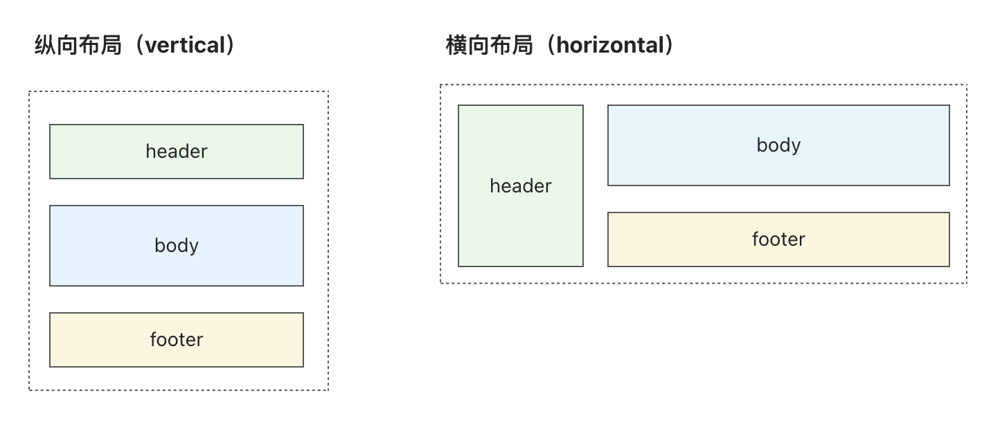

# 布局结构 itemLayout

`itemLayout` 用于定义 `表单项内部` 的布局结构。

常见的布局结构有 2 种：纵向布局（Vertical）和横向布局（Horizontal），下面的章节将举例实现这两种布局。



## 纵向布局 Vertical

```tsx
import Core, { IOpenItemLayoutParams } from '@schema-render/core-react'
import { QuestionCircleOutlined } from '@ant-design/icons'
import { Popover } from 'antd'
import classNames from 'classnames'
import renderers from './renderers/common'
import type { FC } from 'react'

import * as styles from './item-layout/Vertical/styles'

// 定义表单项纵向布局结构 (Vertical)
const Vertical: FC<IOpenItemLayoutParams> = ({
  body,
  schema,
  validator,
  required,
  // 对 classnames 方法的包装，携带 prefixCls 前缀的类名方法
  prefixClassNames,
}) => {
  return (
    <div className={prefixClassNames('item-layout-vertical')}>
      {/* 定义表单项 header 结构与样式 */}
      <div className={classNames(prefixClassNames('item-header'), styles.header)}>
        {/* 定义表单项「必填」状态的展示 */}
        {required && (
          <span className={classNames(prefixClassNames('item-mark'), styles.mark)}>
            *
          </span>
        )}
        {/* 定义表单项「标题」的展示 */}
        <span className={classNames(prefixClassNames('item-title'), styles.title)}>
          {schema.title}
        </span>
        {/* 定义表单项「标题描述」的展示，存在才展示 */}
        {!!schema.titleDescription && (
          <Popover placement="top" trigger="hover" content={schema.titleDescription}>
            <QuestionCircleOutlined
              className={classNames(
                prefixClassNames('item-title-tooltip'),
                styles.titleTooltip
              )}
            />
          </Popover>
        )}
      </div>

      {/* 定义表单项「主要内容」的展示，body 为渲染器组件 */}
      <div className={prefixClassNames('item-body')}>{body}</div>

      {/* 定义表单项「页脚」的展示内容 */}
      <div className={classNames(prefixClassNames('item-footer'), styles.footer)}>
        {/* 定义表单项「校验错误」状态的展示，错误且有错误信息才展示红色错误提示信息 */}
        {validator.status === 'error' && !!validator.message && (
          <div
            className={classNames(prefixClassNames('item-error-msg'), styles.errorMsg)}
          >
            {validator.message}
          </div>
        )}
        {/* 定义表单项「描述信息」的展示 */}
        {!!schema.description && (
          <div className={classNames(prefixClassNames('item-desc'), styles.desc)}>
            {schema.description}
          </div>
        )}
      </div>
    </div>
  )
}

const schema = {
  renderType: 'Root',
  properties: {
    title: {
      title: '标题',
      titleDescription: '标题的一些描述',
      description: '表单项的一些描述',
      required: true,
      renderType: 'InputText',
      renderOptions: {
        maxLength: 10,
        placeholder: '请输入标题，最多10个字符',
      },
    },
    content: {
      title: '内容',
      renderType: 'TextArea',
      required: true,
    },
  },
} as const

const Demo = () => {
  return <Core schema={schema} itemLayout={Vertical} renderers={renderers} />
}

export default Demo
```

## 横向布局 Horizontal

```tsx
import Core, { IOpenItemLayoutParams } from '@schema-render/core-react'
import { QuestionCircleOutlined } from '@ant-design/icons'
import { Popover } from 'antd'
import classNames from 'classnames'
import renderers from './renderers/common'
import type { FC } from 'react'

import * as styles from './item-layout/Horizontal/styles'

// 定义表单项横向布局结构 (Horizontal)
const Horizontal: FC<IOpenItemLayoutParams> = ({
  body,
  schema,
  validator,
  required,
  // 对 classnames 方法的包装，携带 prefixCls 前缀的类名方法
  prefixClassNames,
}) => {
  return (
    <div
      className={classNames(
        prefixClassNames('item-layout-horizontal'),
        styles.horizontal
      )}
    >
      <div className={classNames(prefixClassNames('item-main'), styles.main)}>
        {/* 定义表单项 header 结构与样式 */}
        <div className={classNames(prefixClassNames('item-header'), styles.header)}>
          {/* 定义表单项「必填」状态的展示 */}
          {required && (
            <span className={classNames(prefixClassNames('item-mark'), styles.mark)}>
              *
            </span>
          )}
          {/* 定义表单项「标题」的展示 */}
          <span className={classNames(prefixClassNames('item-title'), styles.title)}>
            {schema.title}
          </span>
          {/* 定义表单项「标题描述」的展示，存在才展示 */}
          {!!schema.titleDescription && (
            <Popover placement="top" trigger="hover" content={schema.titleDescription}>
              <QuestionCircleOutlined
                className={classNames(
                  prefixClassNames('item-title-tooltip'),
                  styles.titleTooltip
                )}
              />
            </Popover>
          )}
        </div>

        {/* 定义表单项「主要内容」的展示，body 为渲染器组件 */}
        <div className={classNames(prefixClassNames('item-body'), styles.body)}>
          {body}
        </div>
      </div>

      {/* 定义表单项「页脚」的展示内容 */}
      <div className={classNames(prefixClassNames('item-footer'), styles.footer)}>
        {/* 定义表单项「校验错误」状态的展示，错误且有错误信息才展示红色错误提示信息 */}
        {validator.status === 'error' && !!validator.message && (
          <div
            className={classNames(prefixClassNames('item-error-msg'), styles.errorMsg)}
          >
            {validator.message}
          </div>
        )}
        {/* 定义表单项「描述信息」的展示 */}
        {!!schema.description && (
          <div className={classNames(prefixClassNames('item-desc'), styles.desc)}>
            {schema.description}
          </div>
        )}
      </div>
    </div>
  )
}

const schema = {
  renderType: 'Root',
  properties: {
    title: {
      title: '标题',
      titleDescription: '标题的一些描述',
      description: '表单项的一些描述',
      required: true,
      renderType: 'InputText',
      renderOptions: {
        maxLength: 10,
        placeholder: '请输入标题，最多10个字符',
      },
    },
    content: {
      title: '内容',
      renderType: 'TextArea',
      required: true,
    },
  },
} as const

const Demo = () => {
  return <Core schema={schema} itemLayout={Horizontal} renderers={renderers} />
}

export default Demo
```

## 参数详解

> 如果是 TypeScript 项目，可以通过 `IOpenItemLayoutParams` 类型了解所有的参数及其注解。

| **参数**             | **说明**                                                                                                | **类型**                                        |
| -------------------- | ------------------------------------------------------------------------------------------------------- | ----------------------------------------------- |
| **schema**           | Schema 协议描述对象                                                                                     | `ISchema`                                       |
| **required**         | 是否必填，值为计算后的结果                                                                              | `boolean`                                       |
| **disabled**         | 是否禁用态，值为计算后的结果                                                                            | `boolean`                                       |
| **readonly**         | 是否只读态，值为计算后的结果                                                                            | `boolean`                                       |
| **validator**        | 校验结果信息，包含 `status(状态)`、`message(提示信息)`、`extra(额外数据)`                               | `object`                                        |
| **locale**           | 当前语言数据                                                                                            | `object`                                        |
| **userCtx**          | 用户全局上下文数据                                                                                      | `object`                                        |
| **body**             | 渲染器组件                                                                                              | `ReactNode`                                     |
| **prefixClassNames** | 对 [classnames](https://www.npmjs.com/package/classnames) 导出方法的包装，带有 prefixCls 前缀的类名方法 | `(...args: classNames.ArgumentArray) => string` |
