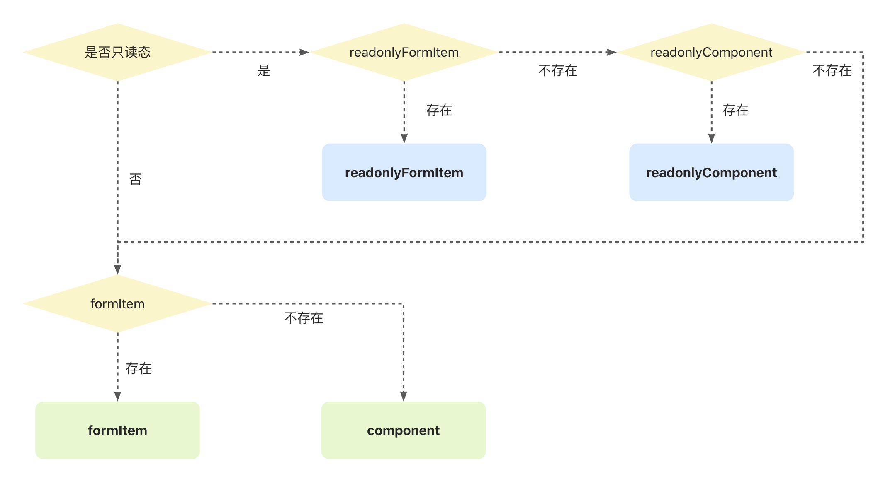

# 渲染器 Renderer

渲染器是主要内容定义的地方，属性如下：

- `component`: 注册渲染器组件，渲染主要内容，`ReactNode` 类型。
- `formItem`: 注册渲染器组件，渲染主要内容，可独立定义布局结构（不受限于 itemLayout 布局），`ReactNode` 类型。
- `readonlyComponent`: 只读态时，`component` 模式的可选替代方案。
- `readonlyFormItem`: 只读态时，`formItem` 模式的可选替代方案。
- `validator`: 渲染器内置校验器，定义与渲染器绑定的校验规则。

渲染器组件注册流程如下：



## component

`component` 模式是常用的定义渲染器组件的方式，因为不需要编写标题与内容的布局结构，由 `itemLayout` 统一管理。

下面通过 `component` 模式实现一个自定义评分渲染器。

```tsx
import { Rate } from 'antd'
import Core from '@schema-render/core-react'
import type { IRenderers, IRootSchema } from '@schema-render/core-react'
import Horizontal from './item-layout/Horizontal'

const renderers: IRenderers = {
  // 定义渲染器名称
  MyRate: {
    // 定义渲染内容，如果属性一致，亦可写成这样 component: Rate
    component: ({ disabled, value, onChange }) => {
      return <Rate disabled={disabled} value={value} onChange={onChange} />
    },
  },
}

const schema: IRootSchema = {
  renderType: 'Root',
  properties: {
    rate: {
      title: '评分',
      // 使用对应渲染器名称
      renderType: 'MyRate',
    },
  },
}

const Demo = () => {
  return (
    <Core
      schema={schema}
      itemLayout={Horizontal}
      /* 注册渲染器 */
      renderers={renderers}
    />
  )
}

export default Demo
```

### component 参数详解

> 如果是 TypeScript 项目，可以通过 `IOpenComponentParams` 类型了解所有的参数及其注解。

| **参数**        | **说明**                                     | **类型**   |
| --------------- | -------------------------------------------- | ---------- |
| **schema**      | Schema 协议描述对象                          | `ISchema`  |
| **value**       | 当前表单项的值                               | `any`      |
| **rootValue**   | 表单整体数据                                 | `object`   |
| **path**        | 当前表单项的路径                             | `array`    |
| **sPath**       | 当前表单项的路径字符串格式表示               | `string`   |
| **required**    | 是否必填，值为计算后的结果                   | `boolean`  |
| **disabled**    | 是否禁用态，值为计算后的结果                 | `boolean`  |
| **readonly**    | 是否只读态，值为计算后的结果                 | `boolean`  |
| **locale**      | 国际化语言数据                               | `object`   |
| **userCtx**     | 用户全局上下文数据                           | `object`   |
| **objectStyle** | 对象类型样式                                 | `object`   |
| **validator**   | 校验器信息，包含校验状态、提示消息与附加数据 | `object`   |
| **onChange**    | 表单项值回调事件                             | `Function` |

### onChange 事件详解

- 函数类型：`(value: any, options?: IOpenChangeOptions) => void`
- `options` 可选参数如下：
  - `triggerValidator`: 是否触发校验器，`boolean` 类型。
  - `extra`: 携带的额外数据，任意类型。

## formItem

`formItem` 模式适用于需要突破 `itemLayout` 的限制，独自定义表单项的布局的场景。

同样以评分渲染器为例，将表单项的标题加粗加红来展示。

```tsx
import { Rate } from 'antd'
import Core from '@schema-render/core-react'
import type { IRenderers, IRootSchema } from '@schema-render/core-react'
import Horizontal from './item-layout/Horizontal'

const renderers: IRenderers = {
  // 定义渲染器名称
  MyRate: {
    // formItem 模式定义渲染内容
    formItem: ({ schema, disabled, value, onChange }) => {
      return (
        <div>
          <strong style={{ color: 'red', marginRight: 10 }}>【{schema.title}】</strong>
          <Rate disabled={disabled} value={value} onChange={onChange} />
        </div>
      )
    },
  },
}

const schema: IRootSchema = {
  renderType: 'Root',
  properties: {
    rate: {
      title: '评分',
      // 使用对应渲染器名称
      renderType: 'MyRate',
    },
  },
}

const Demo = () => {
  return (
    <Core
      schema={schema}
      itemLayout={Horizontal}
      /* 注册渲染器 */
      renderers={renderers}
    />
  )
}

export default Demo
```

### formItem 参数详解

> 如果是 TypeScript 项目，可以通过 `IOpenFormItemParams` 类型了解所有的参数及其注解。

目前 `formItem` 参数与 `component` 参数一致。

## readonlyComponent

编写只读态逻辑有 2 种方式：

- 第一种，在 `component` 组件里通过 `readonly` 状态区分，这种方式会存在 `if` 语句，并且在复杂组件里会导致不必要的状态定义等逻辑。
- 第二种，通过 `readonlyComponent` 声明，可以减少 `if` 语句使得架构更清晰，对于复杂的组件避免触发不必要的状态定义等逻辑。

`readonlyComponent` 参数与 `component` 一致。

```jsx
import { useState } from 'react'
import Core from '@schema-render/core-react'
import Horizontal from './item-layout/Horizontal'
import { Button, Input } from 'antd'

const renderers = {
  InputText: {
    component: ({ schema, value, disabled, readonly, onChange }) => {
      // 在 component 组件里写只读态逻辑
      if (readonly) {
        return <div>{value}</div>
      }

      return (
        <Input
          allowClear
          placeholder={`请输入${schema.title ?? ''}`}
          {...schema.renderOptions}
          value={value ?? ''}
          disabled={disabled}
          onChange={(e) => onChange(e.target.value)}
        />
      )
    },
  },
  TextArea: {
    component: ({ schema, value, disabled, onChange }) => {
      return (
        <Input.TextArea
          rows={3}
          placeholder={`请输入${schema.title ?? ''}`}
          {...schema.renderOptions}
          value={value ?? ''}
          onChange={(e) => onChange(e.target.value)}
          disabled={disabled}
        />
      )
    },
    // 通过 readonlyComponent 声明，可以减少 if 语句，对于复杂的组件避免触发不必要的状态定义等逻辑。
    readonlyComponent: ({ value }) => {
      return <div>{value}</div>
    },
  },
}

const schema = {
  renderType: 'Root',
  properties: {
    title: {
      title: '标题',
      renderType: 'InputText',
    },
    content: {
      title: '内容',
      renderType: 'TextArea',
    },
  },
}

const Demo = () => {
  const [isReadonly, setIsReadonly] = useState(false)
  const [value, setValue] = useState({
    title: 'SchemaRender 是什么',
    content: 'SchemaRender 是一套更好用的表单渲染解决方案',
  })

  return (
    <div style={{ maxWidth: 500 }}>
      <Core
        schema={schema}
        itemLayout={Horizontal}
        renderers={renderers}
        value={value}
        onChange={setValue}
        readonly={isReadonly}
      />
      <Button
        style={{ margin: '20px 0 0 115px' }}
        type="primary"
        onClick={() => setIsReadonly(!isReadonly)}
      >
        {isReadonly ? '取消' : '切换到'} readonly 状态
      </Button>
    </div>
  )
}

export default Demo
```

## readonlyFormItem

`readonlyFormItem` 与 `readonlyComponent` 模式一致，参数与 `formItem` 一致。

## validator

渲染器内置校验器，定义与渲染器绑定的校验规则；详情见 [Renderer Validator](./223-validator#renderer-validator)。
